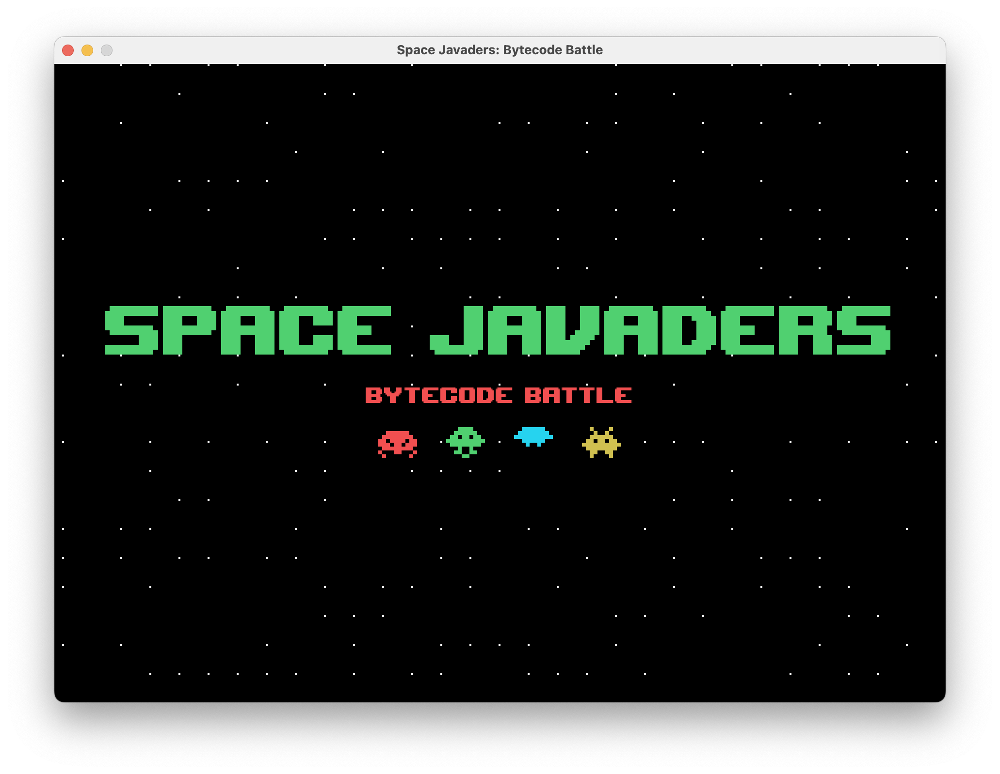

# SpaceJavaders: Bytecode Battle

## About

SpaceJavaders: Bytecode Battle is a basic replica of popular arcade game "Space invaders".
I originally wrote this for a school assignment, and now I am releasing it to the world.
It has one really easy level and it runs quite poorly on low-end computers, but it was really fun to build.

## How to run

- Create a user from the menu bar and log in as that user.
- Select play game from the menu bar.
- Movement is with WASD. Shooting is automatic. Enjoy!

